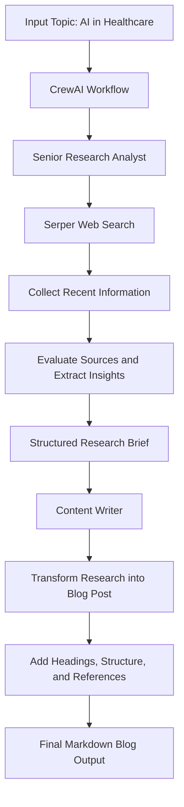

# HealthApp

A **CrewAI-based multi-agent content generation system** focused on the topic of **AI in Healthcare**.

This project uses two AI agents working together in sequence:
- a **Senior Research Analyst** to search and analyze reliable web information
- a **Content Writer** to convert the research into a structured and readable blog post with citations

The system uses **Azure OpenAI** as the LLM backend and **SerperDevTool** for web search.

---

## Overview

This project demonstrates how a **multi-agent AI workflow** can be used to automate research and content creation in the healthcare domain.

The pipeline is divided into two main stages:

1. **Research Stage**  
   A research agent collects recent and relevant information about AI in Healthcare from web sources, evaluates source credibility, and prepares a structured research brief.

2. **Writing Stage**  
   A writing agent transforms the research output into an engaging blog post while preserving the factual content and citations.

---

## Workflow



---

## How It Works

### 1. Topic Definition
The script starts with a predefined topic:

```python
topic = "AI in Healthcare"
```

This topic is passed into the CrewAI workflow and used by both agents.

---

### 2. LLM Configuration
The project uses **Azure OpenAI** as the language model backend.

The LLM is configured using environment variables:
- `AZURE_OPENAI_API_KEY`
- `AZURE_OPENAI_ENDPOINT`
- `AZURE_OPENAI_API_VERSION`

This makes the project reusable across environments without hardcoding credentials.

---

### 3. Research Agent
The first agent is the **Senior Research Analyst**.

Its responsibilities include:
- searching the web for relevant information
- analyzing recent developments and innovations
- identifying industry trends
- collecting expert opinions and statistics
- evaluating source reliability
- producing a structured research report

This agent is connected to the **SerperDevTool**, which allows it to perform web searches.

---

### 4. Writing Agent
The second agent is the **Content Writer**.

Its job is to:
- take the structured research brief
- convert it into an accessible blog post
- maintain factual correctness
- preserve citations and references
- improve readability using markdown headings and sections

---

### 5. Task Execution
The two agents are connected through **CrewAI Tasks**.

- **Task 1:** Research the topic and create a verified research brief
- **Task 2:** Use that research brief to generate a polished blog article

Finally, the workflow is executed using:

```python
result = crew.kickoff(inputs={"topic": topic})
```

The output is printed as the final result.

---

## Architecture

This project follows a simple **multi-agent sequential pipeline**:

- **CrewAI** → handles agent orchestration
- **Azure OpenAI** → provides LLM reasoning and text generation
- **SerperDevTool** → enables external web search
- **Python** → glues the workflow together

---

## Core Components

### Agents
- **Senior Research Analyst**
- **Content Writer**

### Tools
- **SerperDevTool**

### LLM
- **Azure OpenAI (`azure/gpt-4o`)**

### Tasks
- research task
- content writing task

---

## Project Structure

```text
HeathApp/
├── app.py
└── README.md
```

---

## Features

- Multi-agent workflow using CrewAI
- Web-powered topic research
- Azure OpenAI integration
- Automated blog generation
- Citation-aware content creation
- Clear separation between research and writing responsibilities

---

## Input and Output

### Input
A predefined topic inside the script:

```text
AI in Healthcare
```

### Output
A generated markdown blog post containing:
- introduction
- structured sections
- research-based content
- citations
- references

---

## Environment Variables

Create a `.env` file in the project root and add:

```env
AZURE_OPENAI_API_KEY=your_api_key
AZURE_OPENAI_ENDPOINT=your_endpoint
AZURE_OPENAI_API_VERSION=your_api_version
SERPER_API_KEY=your_serper_key
```

---

## Installation

### 1. Clone the repository

```bash
git clone https://github.com/shivanimadhavan/HeathApp.git
cd HeathApp
```

### 2. Install dependencies

```bash
pip install crewai crewai-tools python-dotenv httpx
```

---

## Run the Project

```bash
python app.py
```

---

## Example Execution Flow

```text
Topic: AI in Healthcare

Step 1: Research agent searches the web
Step 2: Research findings are organized into a structured brief
Step 3: Writer agent converts the brief into a blog post
Step 4: Final markdown content is printed
```

---

## Use Cases

This project can be extended for:
- healthcare trend analysis
- automated technical blogging
- domain-specific research summarization
- content pipelines for AI and medical innovation topics

---

## Future Improvements

- Allow user-defined topics instead of a fixed topic
- Save the generated blog to a Markdown file
- Add more agents for fact-checking or editing
- Improve citation formatting
- Support multiple healthcare subtopics
- Add a web interface using Streamlit or FastAPI

---

## Author

**Shivani Madhavan**
